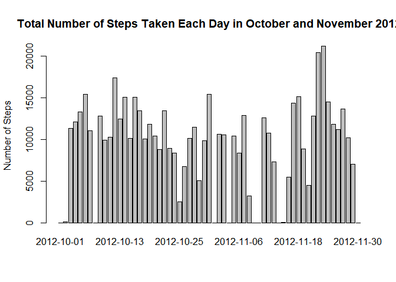
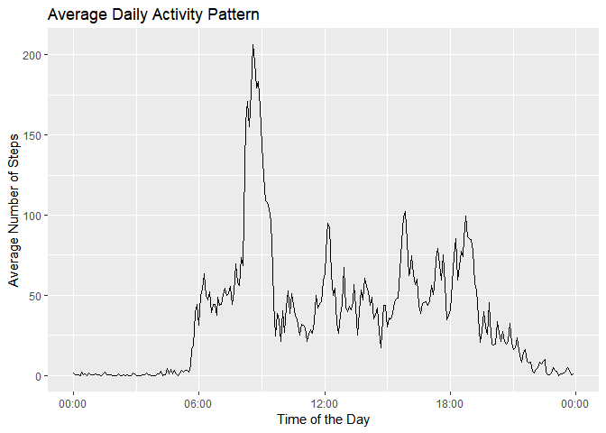
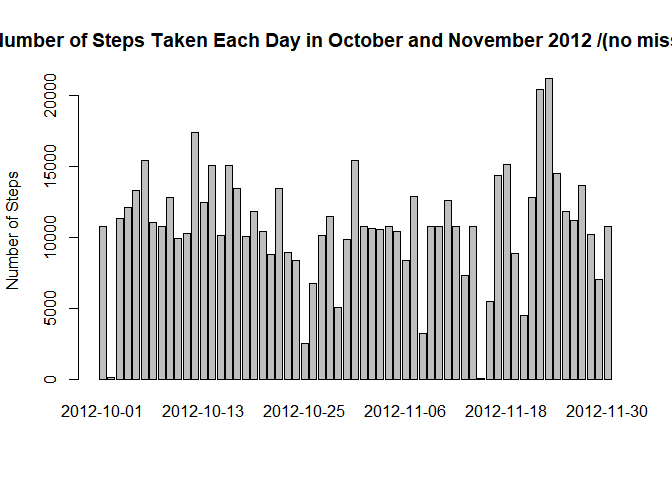
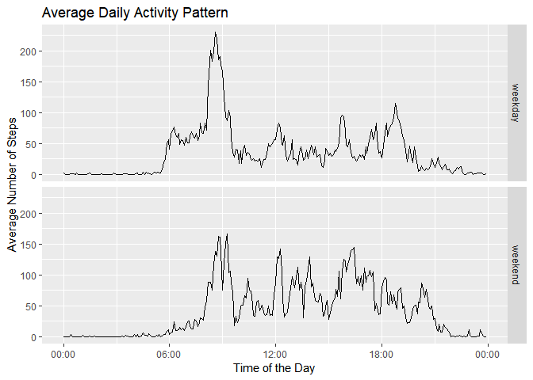

```r
data <- read.csv("./activity.csv")
```

Let's first check the data and change the format of some variables.

```r
str(data)
```

```
## 'data.frame':	17568 obs. of  3 variables:
##  $ steps   : int  NA NA NA NA NA NA NA NA NA NA ...
##  $ date    : Factor w/ 61 levels "2012-10-01","2012-10-02",..: 1 1 1 1 1 1 1 1 1 1 ...
##  $ interval: int  0 5 10 15 20 25 30 35 40 45 ...
```

Let's change the format of steps into a numeric and data into a date format.


```r
library(lubridate)
data$date <- ymd(data$date)
data$steps <- as.numeric(data$steps)
str(data)
```

```
## 'data.frame':	17568 obs. of  3 variables:
##  $ steps   : num  NA NA NA NA NA NA NA NA NA NA ...
##  $ date    : Date, format: "2012-10-01" "2012-10-01" ...
##  $ interval: int  0 5 10 15 20 25 30 35 40 45 ...
```

##1) What is the mean total number of steps taken per day?
To answer this question, the data is grouped by date and summarized using the sum, mean and median, omitting the NA values.

```r
library(dplyr)

sum_steps <- summarize(
  group_by(data,date),
  Total_steps=sum(steps,na.rm=T),
  Mean=mean(steps,na.omit=T),
  Median=median(steps,na.omit=T)
)

head(sum_steps)
```

```
## # A tibble: 6 x 4
##   date       Total_steps   Mean Median
##   <date>           <dbl>  <dbl>  <dbl>
## 1 2012-10-01          0. NA        NA 
## 2 2012-10-02        126.  0.438     0.
## 3 2012-10-03      11352. 39.4       0.
## 4 2012-10-04      12116. 42.1       0.
## 5 2012-10-05      13294. 46.2       0.
## 6 2012-10-06      15420. 53.5       0.
```

Then, the summarized data is visualized in a barplot.

```r
barplot(height=sum_steps$Total_steps,names.arg = sum_steps$date, ylab="Number of Steps" ,main="Total Number of Steps Taken Each Day in October and November 2012")
```

<!-- -->


##2) What is the average daily activity pattern?
Here, the data is summarized by 5-min intervals.


```r
pattern <- summarize(
  group_by(data,interval),
  Average=mean(steps,na.rm=TRUE)
  )

head(pattern)
```

```
## # A tibble: 6 x 2
##   interval Average
##      <int>   <dbl>
## 1        0  1.72  
## 2        5  0.340 
## 3       10  0.132 
## 4       15  0.151 
## 5       20  0.0755
## 6       25  2.09
```

Then, string characters ":" are added to the time intervals to reformat them into real time data "HH:MM" in a new column named "interval2". This step is not mandatory in the analysis but I think it gives the plot more readability.


```r
pattern$interval2 <- pattern$interval
pattern[1:2,3] <- sapply(pattern[1:2,3],function(x) paste0("00:0",x),simplify=TRUE)
pattern[3:12,3] <- sapply(pattern[3:12,3],function(x) paste0("00:",x),simplify=TRUE)
pattern[13:288,3] <- sapply(pattern[13:288,3],function(x) sub("(..)$", ":\\1",x),simplify=TRUE)
pattern$interval3 <- as.POSIXct(strptime(pattern$interval2, format="%H:%M"))
head(pattern)
```

```
## # A tibble: 6 x 4
##   interval Average interval2 interval3          
##      <int>   <dbl> <chr>     <dttm>             
## 1        0  1.72   00:00     2018-08-19 00:00:00
## 2        5  0.340  00:05     2018-08-19 00:05:00
## 3       10  0.132  00:10     2018-08-19 00:10:00
## 4       15  0.151  00:15     2018-08-19 00:15:00
## 5       20  0.0755 00:20     2018-08-19 00:20:00
## 6       25  2.09   00:25     2018-08-19 00:25:00
```

The POSIXct format adds the date of today to the time, but this will be discarded in the plot. Finally, the pattern is plotted.

```r
library(ggplot2)
library(scales)

ggplot(data=pattern,geom="line",aes(x=interval3,y=Average))+
       geom_line()+
      labs(title="Average Daily Activity Pattern",x="Time of the Day",y="Average Number of Steps")+
  scale_x_datetime(date_labels = "%H:%M")
```

<!-- -->

5-minute interval with maximum number of step:

```r
max <- pattern[which.max(pattern$Average),]$interval
```
The 5-minute interval that contains the maximum number of step on average is: **835**.


##3) Total number of missing values
Total number of missing values:

```r
n_miss <- sum(is.na(data$steps))
```
The total number of mssing values is: **2304**.

##Impute missing data
Given the number of 0 for each intervals accross all days, the median gives a less representative average number of steps per interval than the mean. For this reason, NA's were replaced with the mean of all other days at each time interval. A new dataset containing no missing value and named "complete_data" is created.

```r
complete <- data[complete.cases(data$steps),]
missing <- data[!complete.cases(data$steps),]

period <- unique(data$interval)

for (i in period) {
  missing[missing$interval==i,1] <- mean(complete[complete$interval==i,1])
}
complete_data <- rbind(complete,missing)

head(complete_data)
```

```
##     steps       date interval
## 289     0 2012-10-02        0
## 290     0 2012-10-02        5
## 291     0 2012-10-02       10
## 292     0 2012-10-02       15
## 293     0 2012-10-02       20
## 294     0 2012-10-02       25
```


##Total number of steps per day
After filling in the NA values, the total number of steps per date is plotted again.

```r
sum_complete <- summarize(
  group_by(complete_data,date),
  Total_steps=sum(steps),
  Mean=mean(steps),
  Median=median(steps)
)
head(sum_complete)
```

```
## # A tibble: 6 x 4
##   date       Total_steps   Mean Median
##   <date>           <dbl>  <dbl>  <dbl>
## 1 2012-10-01      10766. 37.4     34.1
## 2 2012-10-02        126.  0.438    0. 
## 3 2012-10-03      11352. 39.4      0. 
## 4 2012-10-04      12116. 42.1      0. 
## 5 2012-10-05      13294. 46.2      0. 
## 6 2012-10-06      15420. 53.5      0.
```


```r
barplot(height=sum_complete$Total_steps,names.arg = sum_complete$date, ylab="Number of Steps" ,main="Total Number of Steps Taken Each Day in October and November 2012 /(no missing value)")
```

<!-- -->

Compared with the first barplot of the total number of steps per day, this plot includes the data of more days. In fact, the first plot showed some gaps in the timeline. However, given that missing values were found in entire days (i.e. on each day there were either only missing values or no missing values) and that those days were removed in the calculation of the mean, the missing data did not impact the mean and median in each day.

##4) Differences between weekdays and weekend patterns
To compare weekdays and weekend patterns, weekdays and weekends are distinguished in a new column named "weekday".

```r
complete_data$weekday <- ifelse ((weekdays(complete_data$date) == "samedi" | weekdays(complete_data$date) == "dimanche"),"weekend","weekday")
```

Then, the data is grouped by interval and weekday.

```r
pattern_wkd <- summarize(
  group_by(complete_data,interval,weekday),
  Average=mean(steps)
  )
head(pattern_wkd)
```

```
## # A tibble: 6 x 3
## # Groups:   interval [3]
##   interval weekday Average
##      <int> <chr>     <dbl>
## 1        0 weekday  2.25  
## 2        0 weekend  0.215 
## 3        5 weekday  0.445 
## 4        5 weekend  0.0425
## 5       10 weekday  0.173 
## 6       10 weekend  0.0165
```

Just as earlier, the intervals are reformatted into time data and stored in a new column "interval3", for a better readability of the plot.

```r
pattern_wkd$interval2 <- pattern_wkd$interval
pattern_wkd[1:4,4] <- sapply(pattern_wkd[1:4,4],function(x) paste0("00:0",x),simplify=TRUE)
pattern_wkd[5:24,4] <- sapply(pattern_wkd[5:24,4],function(x) paste0("00:",x),simplify=TRUE)
pattern_wkd[25:nrow(pattern_wkd),4] <- sapply(pattern_wkd[25:nrow(pattern_wkd),4],function(x) sub("(..)$", ":\\1",x),simplify=TRUE)

pattern_wkd$interval3 <- as.POSIXct(strptime(pattern_wkd$interval2, format="%H:%M"))
head(pattern_wkd)
```

```
## # A tibble: 6 x 5
## # Groups:   interval [3]
##   interval weekday Average interval2 interval3          
##      <int> <chr>     <dbl> <chr>     <dttm>             
## 1        0 weekday  2.25   00:00     2018-08-19 00:00:00
## 2        0 weekend  0.215  00:00     2018-08-19 00:00:00
## 3        5 weekday  0.445  00:05     2018-08-19 00:05:00
## 4        5 weekend  0.0425 00:05     2018-08-19 00:05:00
## 5       10 weekday  0.173  00:10     2018-08-19 00:10:00
## 6       10 weekend  0.0165 00:10     2018-08-19 00:10:00
```

Weekday and weekend patterns are shown in the plot below.

```r
ggplot(data=pattern_wkd,geom="line",aes(x=interval3,y=Average))+
      geom_line()+
      labs(title="Average Daily Activity Pattern",x="Time of the Day",y="Average Number of Steps")+
      scale_x_datetime(date_labels = "%H:%M")+
      facet_grid(weekday ~ .)
```

<!-- -->

